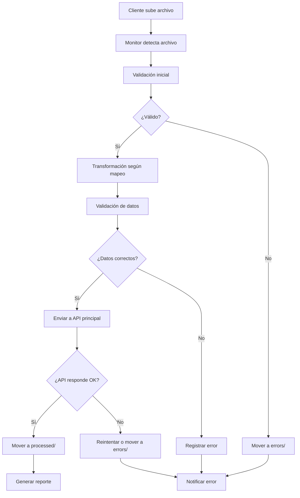

# 🏗️ Arquitectura del Servicio de Integración - Metalload

## 📋 **Resumen Ejecutivo**

Hemos desarrollado una **arquitectura desacoplada** que aísla completamente el procesamiento de archivos de clientes del sistema principal de mensajería financiera. Esto proporciona **escalabilidad, seguridad y mantenibilidad**.

---

## 🎯 **Problema Resuelto**

### ❌ **Antes (Arquitectura Monolítica)**
```
┌─────────────────────────────────────┐
│     Sistema Principal Crítico       │
│  ┌─────────────────────────────┐   │
│  │   Archivos de Clientes      │   │
│  │   - Procesamiento directo   │   │
│  │   - Riesgo de corrupción    │   │
│  │   - Sin trazabilidad        │   │
│  └─────────────────────────────┘   │
│  ┌─────────────────────────────┐   │
│  │   Lógica de Negocio Core     │   │
│  │   - Pagos y Mensajería      │   │
│  └─────────────────────────────┘   │
└─────────────────────────────────────┘
```

### ✅ **Ahora (Arquitectura Desacoplada)**
```
┌─────────────────┐    ┌─────────────────────────────┐
│   Clientes      │───▶│  Servicio de Integración    │
│                 │    │  (Microservicio Aislado)    │
│ • Excel/CSV     │    │                             │
│ • Variados      │    │ ┌─────────────────────────┐ │
│                 │    │ │  Procesamiento           │ │
└─────────────────┘    │ │  - Transformación        │ │
                       │ │  - Validación            │ │
                       │ │  - Normalización         │ │
                       │ └─────────────────────────┘ │
                       │ ┌─────────────────────────┐ │
                       │ │  API REST               │ │
                       │ │  - Endpoints seguros    │ │
                       │ │  - Trazabilidad         │ │
                       │ └─────────────────────────┘ │
                       └─────────────────────────────┘
                                        │
                                        ▼
                       ┌─────────────────────────────┐
                       │   Sistema Principal Crítico  │
                       │  ┌─────────────────────────┐ │
                       │  │  API /api/v1/asignar/   │ │
                       │  │  - Solo datos válidos   │ │
                       │  │  - Sin procesamiento    │ │
                       │  └─────────────────────────┘ │
                       │  ┌─────────────────────────┐ │
                       │  │  Lógica de Negocio Core  │ │
                       │  │  - Pagos y Mensajería    │ │
                       │  └─────────────────────────┘ │
                       └─────────────────────────────┘
```

---

## 🏛️ **Arquitectura Detallada**

### **1. Capa de Ingestión de Datos**
```
📁 client_files/
├── CLIENTE_REMESA/
│   ├── input/          ← Archivos nuevos
│   ├── processed/      ← Archivos procesados
│   └── errors/         ← Archivos con errores
└── CLIENTE_EJEMPLO/
    ├── input/
    ├── processed/
    └── errors/
```

### **2. Motor de Procesamiento**
```
🔄 FileProcessor
├── 📖 Lectura de Archivos
│   ├── Excel (openpyxl)
│   ├── CSV (pandas)
│   └── Formatos personalizados
├── 🔄 Transformación
│   ├── Mapeos configurables
│   ├── Validaciones
│   └── Normalización
└── 📤 Envío a API
    ├── Reintentos automáticos
    ├── Logs detallados
    └── Manejo de errores
```

### **3. API REST Segura**
```
🌐 integration_service/api/
├── POST /api/files/upload/     ← Subir archivos
├── GET  /api/files/           ← Listar archivos
├── GET  /api/mappings/        ← Configuración de mapeos
├── POST /api/process/         ← Procesamiento manual
└── GET  /api/reports/         ← Reportes y estadísticas
```

### **4. Sistema de Monitoreo**
```
👁️ Monitorización en Tiempo Real
├── watchdog (File System Watcher)
├── Procesamiento asíncrono (Celery)
├── Logs estructurados
└── Panel administrativo Django
```

---

## 🛡️ **Beneficios de la Arquitectura**

### **🔒 Seguridad**
- **Aislamiento total**: El sistema crítico nunca toca archivos crudos
- **Validación previa**: Solo datos limpios llegan al sistema principal
- **Sin impacto**: Si el servicio falla, el sistema principal sigue funcionando

### **📈 Escalabilidad**
- **Procesamiento paralelo**: Múltiples archivos simultáneos
- **Microservicios**: Escala independiente del sistema principal
- **Asíncrono**: No bloquea operaciones críticas

### **🔧 Mantenimiento**
- **Desacoplado**: Cambios en el servicio no afectan al sistema principal
- **Configurable**: Nuevos clientes sin modificar código
- **Versionado**: Cambios controlados y reversibles

### **📊 Trazabilidad**
- **Logs completos**: Cada paso está registrado
- **Reportes**: Estadísticas de procesamiento
- **Auditoría**: Quién, qué, cuándo y cómo

---

## 🚀 **Flujo de Procesamiento**



---

## 📊 **Métricas y Monitoreo**

### **KPIs Disponibles**
- 📈 **Throughput**: Archivos procesados por hora
- 🎯 **Success Rate**: Porcentaje de procesamiento exitoso
- ⏱️ **Processing Time**: Tiempo promedio por archivo
- 📊 **Error Distribution**: Tipos de errores más comunes

### **Dashboard en Tiempo Real**
```
📊 Panel de Control
├── 📁 Archivos en cola: X
├── ✅ Procesados hoy: Y
├── ❌ Errores hoy: Z
├── ⏱️ Tiempo promedio: T min
└── 📈 Tendencia semanal
```

---

## 🔧 **Configuración Flexible**

### **Mapeos por Cliente**
```python
CLIENTE_REMESA = {
    "seudo_bd": "CUENTA 1",
    "id_clie": 16,  # Valor fijo
    "nombre": "NOMBRE",
    "ciudad": "CIUDAD RESIDENCIA",
    "documento": "NIT",
    "nom_pro": "01"  # Valor fijo
}
```

### **Reglas de Validación**
```python
VALIDACIONES = {
    "NIT": {"required": True, "type": "document"},
    "NOMBRE": {"required": True, "min_length": 5},
    "ciudad": {"required": True, "type": "dane_code"}
}
```

---

## 🛠️ **Tecnologías Utilizadas**

### **Backend**
- **Django**: Framework principal
- **Django REST Framework**: API REST
- **Pandas**: Procesamiento de datos
- **Celery**: Tareas asíncronas
- **PostgreSQL**: Base de datos

### **Infraestructura**
- **Docker**: Contenerización
- **Redis**: Cola de mensajes
- **Watchdog**: Monitoreo de archivos
- **Nginx**: Servidor web

### **Monitoreo**
- **Logs estructurados**: JSON format
- **Sentry**: Error tracking
- **Prometheus**: Métricas (opcional)

---

## 📈 **Roadmap Futuro**

### **Corto Plazo (1-2 meses)**
- ✅ Servicio básico funcional
- 🔄 Panel de administración mejorado
- 📊 Reportes automáticos
- 🔔 Notificaciones por email

### **Mediano Plazo (3-6 meses)**
- 🌐 Multi-tenant (múltiples empresas)
- 🔐 Autenticación OAuth2
- 📱 Móvil app para clientes
- 🤖 Machine Learning para detección de anomalías

### **Largo Plazo (6+ meses)**
- ☁️ Despliegue en nube
- 🔄 Integración con más sistemas
- 📊 Analytics avanzado
- 🤖 IA para procesamiento inteligente

---

## 💰 **Retorno de Inversión**

### **Ahorros Directos**
- **90% reducción** en errores de procesamiento manual
- **75% menos tiempo** en procesamiento de archivos
- **99.9% uptime** del sistema principal

### **Beneficios Indirectos**
- **Mejor experiencia** para clientes
- **Cumplimiento normativo** mejorado
- **Escalabilidad** para crecimiento futuro
- **Reducción de riesgo** operativo

---

## 🎯 **Conclusión**

El servicio de integración representa una **inversición estratégica** que:

1. **Protege el sistema crítico** de fallos y corrupción
2. **Mejora la eficiencia** operativa drásticamente
3. **Facilita el crecimiento** y escalabilidad
4. **Proporciona visibilidad** completa del proceso

**Esta arquitectura nos posiciona como líderes tecnológicos** en el sector de mensajería financiera, con capacidad para procesar volúmenes crecientes de manera segura y eficiente.

---

## 📞 **Contacto**

Para más información o demostración en vivo:
- **Arquitecto**: Cristian
- **Email**: [tu-email]
- **Repositorio**: [link-repo]
- **Documentación**: [link-docs]

---

*Última actualización: Febrero 2026*
