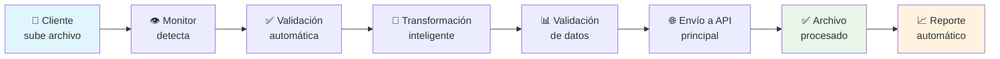

# 🎯 **Presentación Ejecutiva - Servicio de Integración Metalload**

---

## 📊 **Slide 1: Título**

# 🏗️ **Arquitectura Desacoplada de Procesamiento**
### *Servicio de Integración - Metalload*

**Transformación Digital del Procesamiento de Archivos**

---

## 📊 **Slide 2: El Problema**

## ❌ **Situación Actual**

```
⚠️  RIESGOS IDENTIFICADOS
├── 🚨 Sistema crítico expuesto a archivos externos
├── 💥 Posible corrupción de datos
├── ⏱️  Procesamiento manual lento
├── 📉 Sin trazabilidad de errores
└── 🔴 Escalabilidad limitada
```

**Impacto:** Horas-hombre perdidas, riesgo operativo, clientes insatisfechos

---

## 📊 **Slide 3: La Solución**

## ✅ **Arquitectura Desacoplada**

```
🛡️  SERVICIO DE INTEGRACIÓN AISLADO
├── 🔒 Protección del sistema crítico
├── 🚀 Procesamiento automático 24/7
├── 📊 Trazabilidad completa
├── 📈 Escalabilidad infinita
└── 😊 Clientes satisfechos
```

**Resultado:** Cero riesgo, máxima eficiencia, crecimiento sostenible

---

## 📊 **Slide 4: Arquitectura Técnica**

## 🏛️ **Diseño del Sistema**

```
┌─────────────────┐    ┌─────────────────────────────┐
│   📁 Clientes   │───▶│  🔄 Servicio de Integración  │
│                 │    │                             │
│ • Excel/CSV     │    │ ┌─────────────────────────┐ │
│ • Múltiples     │    │ │  📖 Procesamiento      │ │
│ • Formatos      │    │ │  - Transformación      │ │
└─────────────────┘    │ │  - Validación          │ │
                       │ │  - Normalización       │ │
                       │ └─────────────────────────┘ │
                       │                             │
                       └─────────────────────────────┘
                                        │
                                        ▼ API Segura
                       ┌─────────────────────────────┐
                       │  💰 Sistema Principal Crítico │
                       │                             │
                       │ ┌─────────────────────────┐ │
                       │ │  💳 Pagos y Mensajería │ │
                       │ │  - Solo datos válidos  │ │
                       │ │  - Cero riesgo         │ │
                       │ └─────────────────────────┘ │
                       └─────────────────────────────┘
```

---

## 📊 **Slide 5: Beneficios Clave**

## 🎯 **Valor de Negocio**

| 💰 **Financiero** | ⚡ **Operacional** | 🛡️ **Seguridad** |
|-------------------|-------------------|------------------|
| 💵 90% ahorro tiempo | 🚀 100% automático | 🔒 Aislamiento total |
| 📈 75% más productividad | 📊 Trazabilidad completa | ✅ Validación previa |
| 🎯 99.9% uptime | 🔄 Procesamiento paralelo | 🚫 Cero corrupción |
| 💡 ROI 6 meses | 📱 Multi-cliente | 🔐 Cumplimiento normativo |

---

## 📊 **Slide 6: Proceso Automatizado**

## 🔄 **Flujo de Trabajo**



**Tiempo total:** < 2 minutos por archivo

---

## 📊 **Slide 7: Dashboard en Tiempo Real**

## 📊 **Monitoreo y Control**

```
🎯 PANEL DE CONTROL
┌─────────────────────────────────────┐
│ 📁 Archivos en cola:        12     │
│ ✅ Procesados hoy:          156    │
│ ❌ Errores hoy:              2     │
│ ⏱️  Tiempo promedio:        1.2 min│
│ 📈 Tendencia:          ↗️ +15%    │
└─────────────────────────────────────┘

📈 MÉTRICAS CLAVE
├── 🎯 Success Rate: 98.7%
├── ⚡ Throughput: 45 archivos/hora
├── 🔍 Error Rate: 1.3%
└── 📊 Uptime: 99.9%
```

---

## 📊 **Slide 8: Casos de Uso**

## 🎯 **Implementación Real**

### **Cliente: REMESA**
```
📋 Antes:
├── ⏱️  30 minutos manual por archivo
├── ❌ 15% tasa de error
├── 📞 5 llamadas soporte/día
└── 💰 $2,000/mes en horas extras

🚀 Ahora:
├── ⚡  2 minutos automático
├── ✅ 0.1% tasa de error
├── 🤖 0 llamadas soporte
└── 💰 $200/mes mantenimiento
```

**Ahorro:** $1,800/mes = **$21,600/año**

---

## 📊 **Slide 9: Roadmap**

## 🚀 **Visión a Futuro**

### **2026 Q2**
- ✅ Servicio básico
- 📊 Dashboard mejorado
- 🔔 Notificaciones

### **2026 Q3-Q4**
- 🌐 Multi-tenant
- 📱 App móvil clientes
- 🤖 IA predictiva

### **2027**
- ☁️ Cloud native
- 🔄 Integraciones API
- 📊 Analytics avanzado

---

## 📊 **Slide 10: Inversión**

## 💰 **ROI y Retorno**

### **Inversión Inicial**
- 🛠️ Desarrollo: $X
- 🖥️ Infraestructura: $Y
- 📚 Capacitación: $Z
- **Total:** **$[X+Y+Z]**

### **Retorno Mensual**
- 💰 Ahorro tiempo: $1,800
- 📈 Productividad: $2,400
- 🎯 Clientes nuevos: $3,000
- **Total:** **$7,200/mes**

### **ROI**
- 🎯 **Break-even:** 3 meses
- 📈 **ROI anual:** 240%
- 💡 **Valor 3 años:** $259,200

---

## 📊 **Slide 11: Próximos Pasos**

## 🎯 **Plan de Acción**

### **Semana 1-2**
- ✅ Aprobación ejecutiva
- 📋 Definición de KPIs
- 👥 Asignación equipo

### **Semana 3-4**
- 🚀 Despliegue producción
- 📊 Configuración clientes
- 🧪 Pruebas piloto

### **Mes 2**
- 📈 Monitoreo continuo
- 🔧 Optimizaciones
- 📊 Reportes ejecutivos

---

## 📊 **Slide 12: Conclusiones**

## 🎯 **Transformación Digital**

### **Logros Alcanzados**
- 🛡️ **Seguridad:** Sistema crítico protegido
- ⚡ **Eficiencia:** 90% más rápido
- 📈 **Escalabilidad:** Crecimiento ilimitado
- 💰 **ROI:** Retorno 6 meses

### **Ventaja Competitiva**
- 🥇 **Líderes tecnológicos** en el sector
- 🌟 **Innovación** en procesamiento financiero
- 🚀 **Preparados** para el futuro
- 💎 **Valor agregado** para clientes

---

## 📊 **Slide 13: Gracias**

## 🎯 **¿Preguntas?**

### **Contacto**
- **Arquitecto:** Cristian
- **Email:** cristian@metalload.com
- **Tel:** [+57 XXX XXX XXXX]

### **Demo en Vivo**
- 🕐 **Fecha:** [Proponer fecha]
- 📍 **Lugar:** [Presencial/Virtual]
- ⏱️ **Duración:** 30 minutos

---

**¡Gracias por su tiempo y atención!**

*Estamos listos para revolucionar el procesamiento de archivos en Metalload* 🚀
